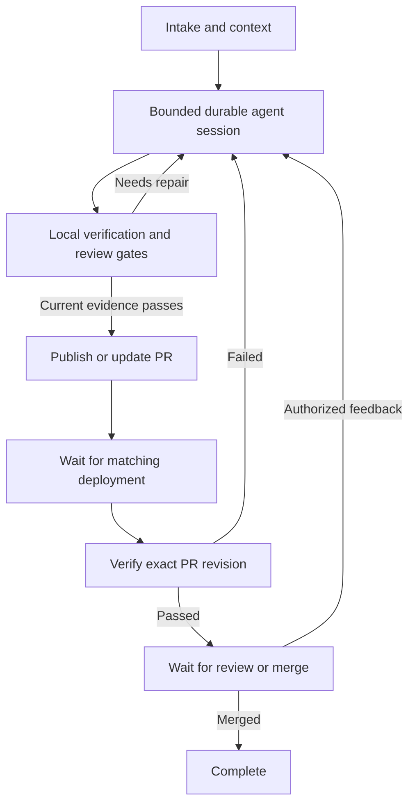

# Execution graph assessment

Implementation follow-up: the lifecycle now has declarative transitions and file-backed
operation checkpoints. The user subsequently required runtime persistence in files; the
SQLite recommendation below records the original assessment, not the final storage choice.
See the README for the implemented file layout and migration procedure.

Assessed 2026-09-17 against the current working tree on `fix/crash-resilient-execution`
(HEAD `ef4bcf4`, with pre-existing local modifications). No VISION.md was present.
This is source and test inspection, not a measured performance comparison.

## Recommendation

Adopt selected execution-graph principles for the durable lifecycle; retain the
bounded agent reasoning/tool loop. A wholesale graph-framework migration is not
justified by the current evidence. The project already implements much of the
operational behavior motivating the article.

Source: [Morlex's post](https://x.com/0xMorlex/status/2080598414576812378), linking
[From loop designer to Graph architect: the 13-step roadmap](https://x.com/i/article/2080239241162805248).
See [source retrieval and analysis](research/graph-engineering-source.md).
The article concerns execution/control flow, distinct from this project's repository
knowledge graph and verification evidence graph. Its author also cautions that
most agents do not need a graph.

## What exists

- `src/workflow.py:1059`: asyncio scheduling, concurrency limits, recovery and wakeups.
  An execution graph still needs this kind of executor.
- `src/workflow.py:696`: a durable lead session drives lifecycle tools; deployment
  testing and external event routing remain harness responsibilities.
- `src/agent.py:1282`: SDK and subscription CLI backends use durable sessions.
  The phase-by-phase fallback in `_process_unleased` is not the entire production
  architecture. A replacement must account for both backend paths.
- `src/task_catalog.py:96`: task state and transition events commit in one SQLite
  transaction. Leases and workspace identities also already exist.
- `src/workflow.py:249`: publication checks current verification evidence and the
  responsibility-area plan. `src/verify.py:30` checks exact deployment identity.
- `src/verification_graph.py:115`: dependency-sensitive input hashing, passing-test
  reuse and invalidation; `plan` orders verification in concentric rings.

Tests in `tests/test_long_horizon.py` exercise durable lifecycle routing and review
recovery. `tests/test_verification_graph.py` covers resumed verification and cache
invalidation. They were inspected, not executed for this assessment.

## Valuable additions

1. **Central transition specification.** Lifecycle guards are distributed across
   methods and branches. `src/storage.py:367` accepts a target state without an
   allowed-edge check. A declared transition table, event conditions and evidence
   guards would make legal transitions auditable. Validate missing targets,
   unreachable states and explicit terminal/wait states. Topology checks do not
   replace the evidence guards.
2. **Persisted operation-level accounting.** `TaskRecord.attempts` is shared across
   several failure modes; agent turns have invocation limits. Add operation identity,
   attempts and remaining budgets that survive restarts. Count retries by operation
   and relevant revision, with an overall task cap so revision changes cannot evade it.
3. **Recoverable side-effect boundaries.** Checkpoint intent and outcome for publish,
   review and verification operations. Existing GitHub publication already looks up
   an open PR by branch and checks its SHA. Preserve and extend this reconciliation:
   a crash after a remote effect but before a checkpoint cannot be solved by routing
   alone. Do not replay arbitrary shell writes as though they were pure functions.
4. **Execution traces tied to revisions.** Existing task events, shell logs and metrics
   offer a foundation. Add node/operation ID, input revision, outcome, routing reason
   and duration to diagnose where a repair stalls and compare policies.

Explicit fan-out/join could eventually help independent read-only investigations or
isolated checks. Concurrent implementation in one task worktree requires separate
coordination; graph edges alone do not prevent conflicting edits.

## Suggested shape

This is a conceptual boundary diagram, not a claim that the current session returns
at every box. The existing session can invoke verification and publication tools
itself. A first iteration can declare/validate those tool transitions without
splitting the lead session into a new model call per phase. All executable stages
also need bounded failure, cancellation and blocked outcomes.

## Costs and limits

A full replacement risks two scheduling/state authorities, migration of active tasks,
changed SDK/CLI resume semantics, fragmented investigation context and redundant
framework persistence. Immutable records can simplify routing, but live model calls,
filesystem edits and remote APIs remain nondeterministic or side-effecting. The
article's illustrative in-memory checkpoints are not a substitute for this harness's
SQLite catalog and recovery behavior.

Start with a declarative lifecycle specification using the existing executor and
SQLite, plus persisted operation records for one costly boundary. Only expand after
comparison against the current harness on representative incidents and injected
crashes around external effects. Measure verified repair success, duplicate effects,
repeated expensive work, time, tokens/cost and operator interventions. The bundled
scripted repair evaluation checks harness behavior; it does not establish model
quality or prove that a graph will save tokens.
